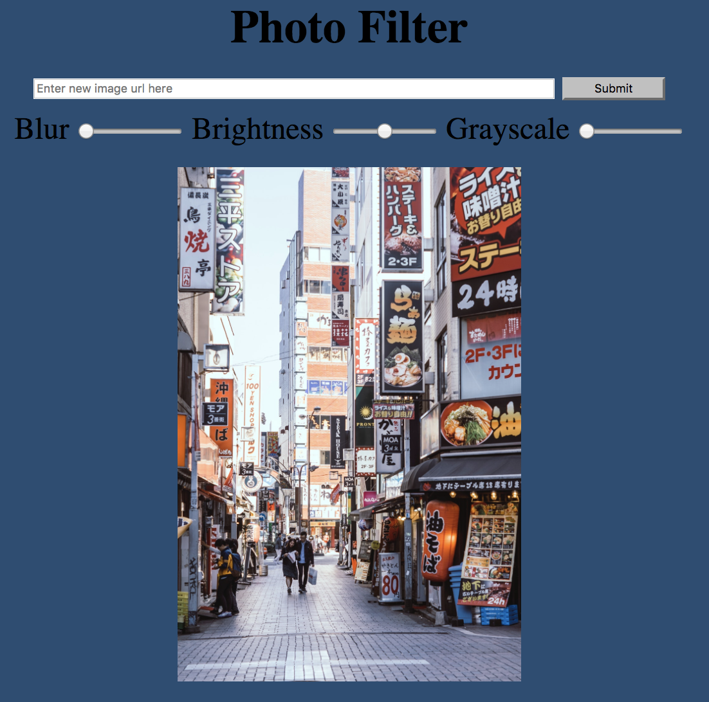
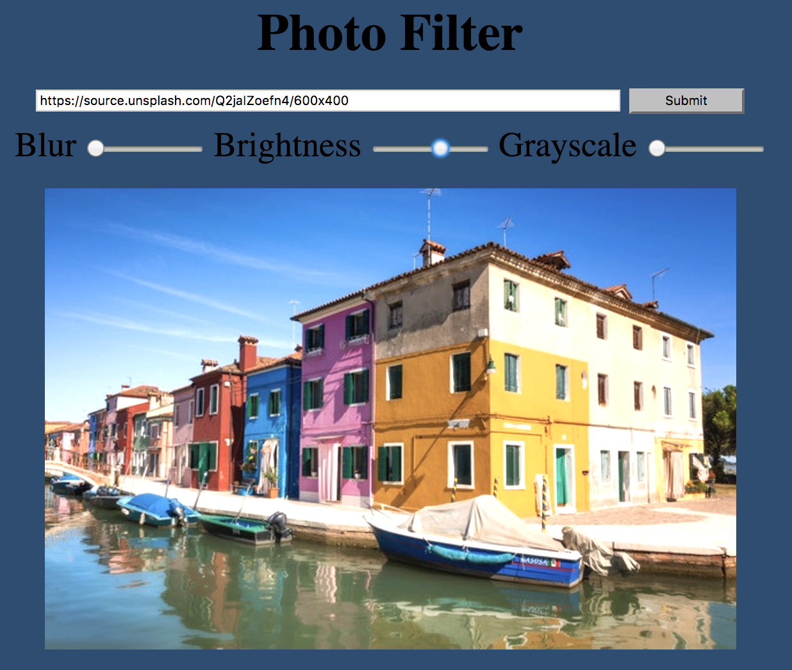
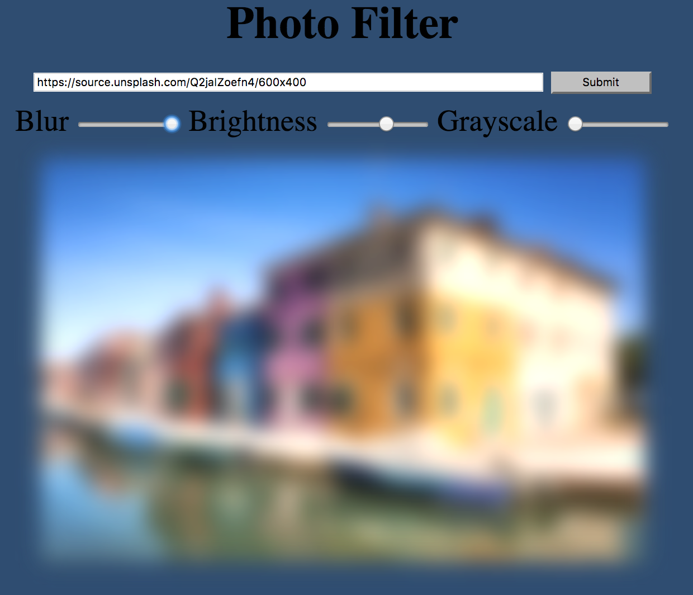

# Photo Filter

[Live site](https://spookybit.github.io/photo_filter/)

This is a photo filter that uses CSS and Javascript to manipulate an image.
Enter the url of another image to filter as well.
Upload an image from your computer.

## Example

## TODOS
A drawing feature that allows someone to sketch over the image.
Stickers to place over photo.
